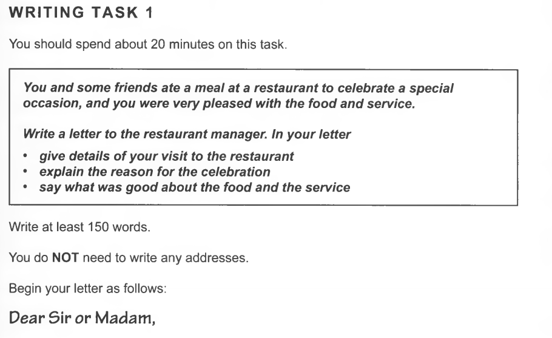
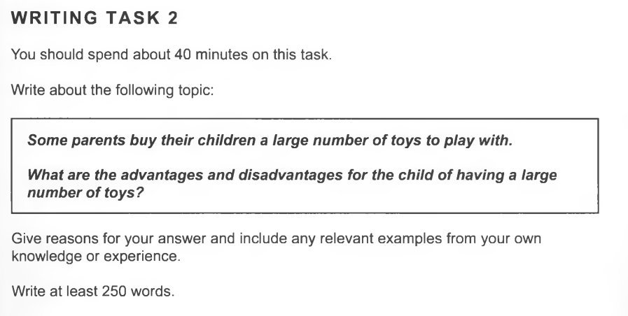
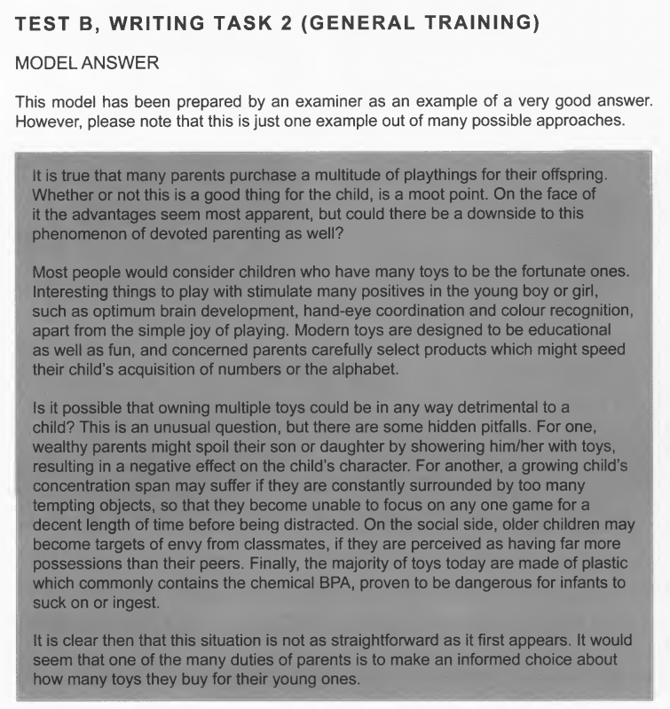
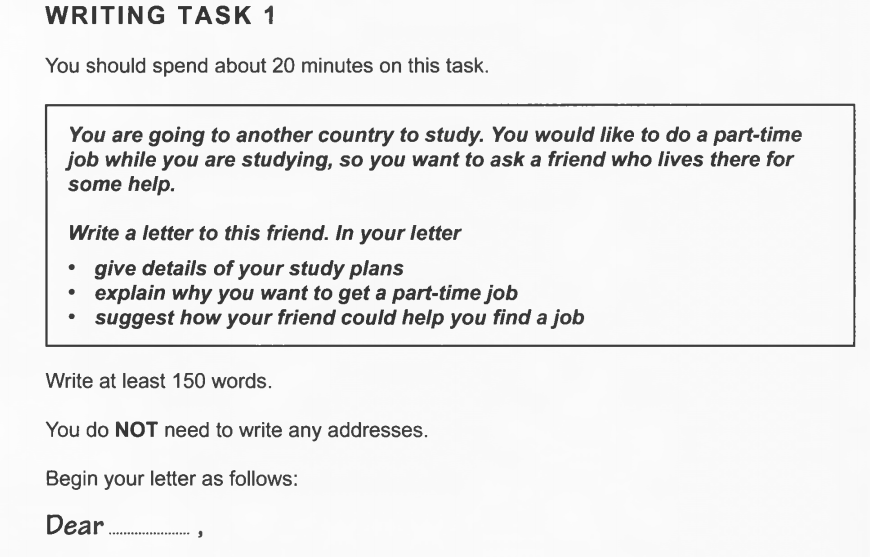
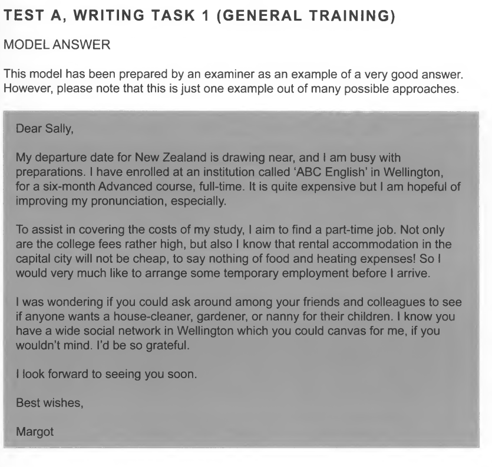
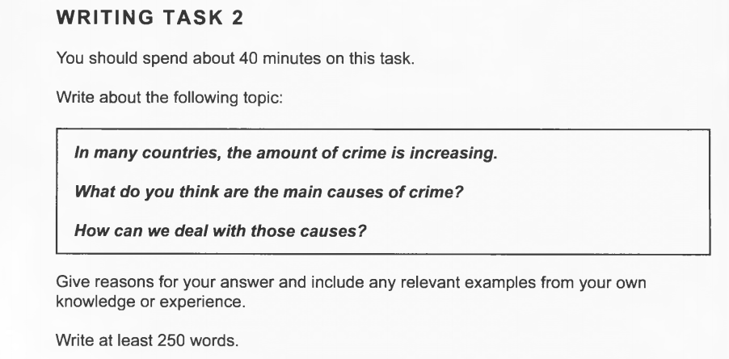
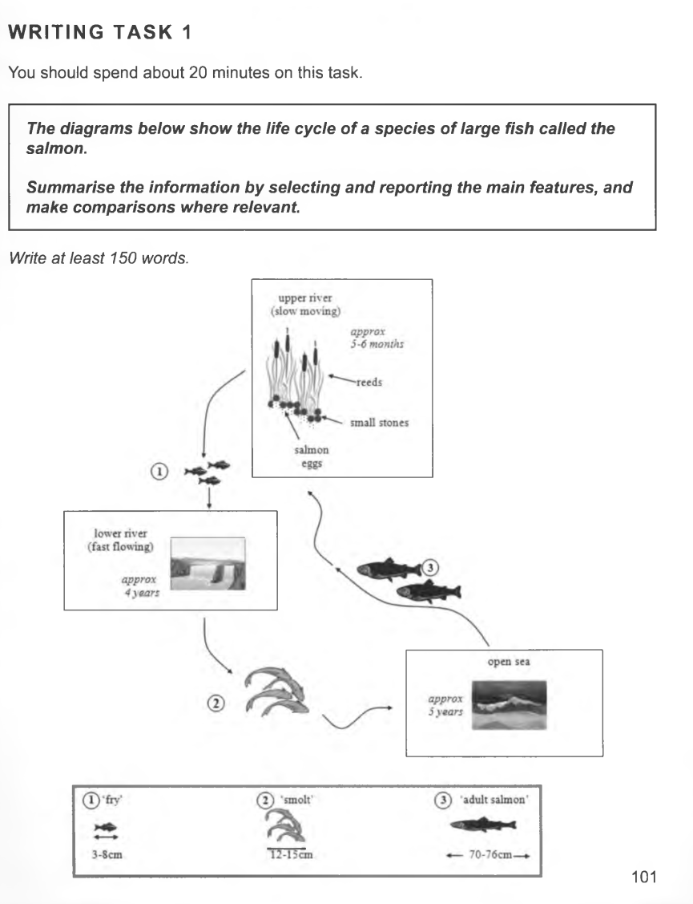
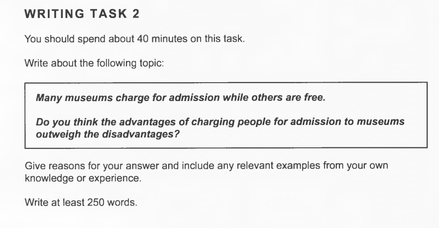
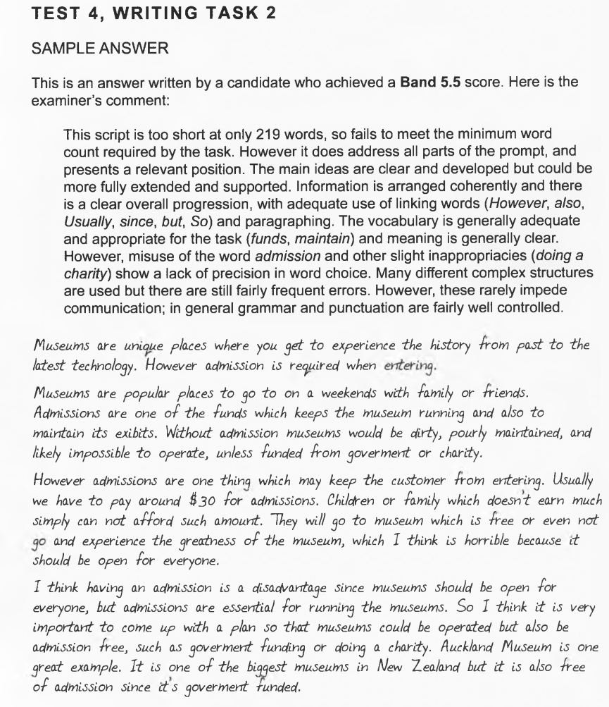

## TESTB 
### topic 1

>Dear Sir or Madam,
Me and my friends had a wonderful dinner at your restaurant. How to say that, when I went to have the same steak at my place, I was wondering how hard cooking something can really be. It's just using the best meat that I have, with all the thing and little secretes from the recipe, after all this that I could only figure out what a great job that you have done to those beef. They are just amazing. So, last Thursday night, while hanging for a rather long time wondering the exhibition held by my friend Jack, with the mask on for a very long time, still trying to respond to people's questions, Jack suggested to have some well-cooked meat to fill us up, also to celebrate the success and completion of the long lasted event. 
Your steak house is of an exotic genre, from the outside we thought it's a good whisky bar, but with no expectation for the food. However, your professionalism just shocked us down. The wine, the music, together mixed with the aroma from the food... Just as fantastic and surprise as you gave to us! We really have to admit that you're a total genius.
Thanks again for the meal, as all the experiences. Also looking forward for your craft beer as well.
Best wishes,
Joseph
### ans to 1

### comment on 1
>$1$ event, people, time all seemed common as water, as very general expressions used
$2$ seating arrangement--> **went out of the way** instead of surprise  easily accessible, /did not interfere with the dinner/i find it unusual these days other restaurant
TODO
$3$ current menu great deal of choice/ wine list 
$4$ i ordered/ pork fibs/delicious and sufficient /*if anything* maybe too large/manage to finish it
$5$ impressed with local and international wine/correct temperature/waiter etiquette/service was paramount
$6 enjoyed a delicious meal **at your establishment**

### topic 2

>Toys are one of the sweet memories for all of us when enjoying our worriless and innocent kids' moments. It's well noticed that, parents tend to buy a large number of toys, which benefits from the development of modern industry, however can be a challenge of environment in the future.
Toys are sweet, they are designed and developed ever back in long last history. Children are actually learning by playing toys, no matter it's a car or a barbie doll. Kids are developing their little brain in the progress of playing the toys they are given, by interacting with these little things. Also, toys are librating the parents from being "the toy" of their kids. So, the reason for parents to buy a lot of toys are clear, not to mention their love for the kid and under their begging for a lot of times.
Toys also have their problem once it's given to much. Like learning, you never learned only if you dig deep enough into one thing rather than take overviews of one thousand. Kids can be easily satisfied when given new gift, but they never learned from simple asking. With more stuff created in the market, we also create billions of waste and pollution to the environment. Kids are growing up and getting boring of their last toy, but environment can't really take too much.
However, in my opinion, toys are positive, especially in a world full of computer games. What I'm thinking of a great resolution is a proper combination of both computer and real toys, that parents should never leaning much over to only one side. 

### ans to 2

### comment on 2
>$1$ a multitude of --> a lot of/ for their **offspring**/whether or not, **moot** point/phenomenon
$2$ fortunate/apart from /educational as well as fun/ **concerned** **parent** select to speed up child's acquisition of numbers and alphabet
$3$ **detrimental**/ hidden **pitfalls**/ showering them with toys/**concentration span** may suffer from too many tempting objects/
$5$ not as straightforward as it first appears/one of duties is informed choice ab**out buying **/

---

## TESTA
### topic 1

>Dear Paul,
As I told you, my application to the technology institute is permitted. I plan to finish a master degree in design of calculation and computer science for like two year. Thanks to the help with the applying materials and also, your native language skills.
So, by the time of next autumn, I'm coming to London to start my new semester. I plan to look for a part-time job in spare time, because you know, I'm not the type of person who can stay alone at the computer for a whole day. I think that some exercise and communication with local folks would be a very good opportunity to get into contact with this brand new environment for me. Since you have started your career in London, I'm very in need of your advice.
I don't think that I should start to work in the Internet companies, since it's just a part-time job and I really don't want it to be very complicated and consumes a lot of energy everyday. What do you think of work in a gym? Some time of free work out is also a benefit. Would you help me to look for some part-time jobs that you think I'm competent.
Your Sincerely,
Joseph

### ans to 1

### comment to ans1
>$1$ departure time, drawing near/ preparations/ **enrolled at** an situation 
$2$ to assist covering the costs -->compensate/aimed to find a part-time job/**not only** the tuition fee, **but also** the accommodation, **not to say** the food 
$3$ house-cleaner /nanny/ wide social network /i'd be so grateful

### topic 2

>As is stated, the crime rate is raising among the majority of countries, which usually happens to mostly undeveloped nations like countries in Africa of South America, where the drugs and gangsters become a problem along the modern history. But now, even in countries like the US, more and more crime problems have become a serious society issue under both parties' concern.
For most undeveloped countries, there is hardly a strong and powerful government who can take care of citizens' public security. Public security is a basic but fundamental structure in the nation's governance. Poor countries are often in short hands of social resources, and often not in good status when establishing the country ever since. Like the bases of a building, the public security issue becomes more of a problem once the country started to heading for economic growth, as if the building goes higher, the unstable bases cause an evident shake on top.
However, things are not the same in developed countries, especially for US, and other old, well-developed nations in EU. These countries are mostly bothered with illegal immigrants and drug dealing problems, which are often from the outside, from those poor and undeveloped countries as we mentioned above. In today's world, it's hard to step aside and only focusing on domestic economic development, a stable and peaceful global environment is also required, which I believe is more important for the developed ones.
In all, to deal with the crime issue is not a domestic problem. Powerful countries should work together to create a better cross-country global relation as we founded  UN last century, so that countries can communicate and really come to deal with crime issue.

### ans to 2: but a bad answer
>I am going to write about how the amount of crime is increasing in many countries and why.
Nowadays there are many countries has increasing on the amount of crime and I think the problem is that mast of the crime has done by the young people which is under 18 and from the age you can see and you can understand what is going on but in my opinion I think the main causes is the family and the school,the family I mean th mom an dad they have to look after their teenagers until they grow up and do not le them watch films which has a fight or blood, the school is the same as the second house for the teenagers and they have to teach them how to grow up in good way and teach them how to respect the old people.
For example I have been told from my oldest brother that in the UK 2 years ago a boy from Qatar he is l years old has Killed by groups of teenagers in Haisting and the killed him without any reasons and when the Police asked them why did you do that they said we want to show of we are the best.So you can say they learn from the action movies.
Finally I hope all the people can help the teenagers to give them advice and to let the know what will happen after the crime Also in schools they must teach them how to avoid the bad movies and to grow up in safe way

### comment on ans2
>Both parts of the prompt are addressed,although the main ideas and the writer's
position could be better developed. No clear conclusions are drawn so there is a
lack of overall progression.Organisation is evident but not always logical,and the
sentences are not fluently linked to each other,while each paragraph lacks a clear
topic.**The vocabulary is limited but minimally adequate**,with not much variation
in expression,and the frequent **spelling errors** are noticeable and cause some
difficulty for the reader.**The range of sentence types is limited and rather repetitive**
Complex sentences are attempted but tend to be faulty,and there are a number of
basic errors.Punctuation is poorly controlled,with underuse of capital letters and
fullstops                                  

---

## TEST4

### topic 1

Salmon fish is more than a adorable dish for human. Along their life they've been traveling around for a really long journey instinctively, taught by mother nature.
Salmon fish is raised under seeds, among the small stones. That's where they have been used for generations, where the mature ones come back to. Usually it's upper stream of a river so the flow is slow and peace. Little salmon fishes come out from the eggs and stay there for around five to six month so they can grow. During this  childhood time they are actually very small, around 3 to 8cm and are called "fry".
When they grow up, they find themselves bigger and settling along the river to the fast flow lower part, where they get more space and nutrition. This time can be considered as teenager time, for about four years, finally they are over 10cm and are called "smoft".
When salmon fishes are mature, they will head for the open sea to become a sea animal. In the ocean the salmon fishes are about to stay for approximately 5 year to become an "adult salmon", and their size varies from 70 to 76cm. The adult fish will then swim back to the birth place to lay eggs and finally die there, leaving the offsprings where the parents used to grow up. And that the life cycle of a salmon.

### ans to 1

>Salmon begin life as eggs on a pebbly riverbed,hidden among reeds in the slow-
moving upper reaches of a river.After five to six months the eggs hatch into 'fry'.
For approximately the next four years,these baby salmon will live in the lower,
faster-flowing waters of their river.During this time they measure between three
and eight centimetres in length
By the time salmon reach twelve to fifteen centimetres,they are termed 'smolt',and
at this time they migrate further downriver into the open sea.After five years at sea
the salmon will have grown to adult size,which is between seventy and seventy-six
centimetres.They then begin swimming back to their birthplace,where they will lay
their eggs,and the cycle starts anew.
In summary,the salmon passes through three distinct physical stages as it grows
to maturity.Each of these stages takes place in a very different aquatic location.
It is noteworthy that the first two stages of this fish's life occur in a freshwater
environment,while the third stage is lived in saltwater.

### comment on 1
>This model has been prepared by an examiner as an example of a very good answer.
However,please note that this is just one example out of many possible approaches.

>$1$ pebbly 多砾石的 声音刺耳的/ riverbed/hatch into 
$2$ fast-flowing/ they measure between in lenth
$3$ by the time reach centimeters/ they are termed 'smolt'/migrate/ grown to adult size / circle starts anew adv.再一次
$4$ 这一段要对比 题目的 要求 3 distinct physical stages as it grows to maturity/ each of the stages takes place in a different aquatic location/ It's noteworthy/first two occur in fresh water env while the third stage in saltwater.

### topic 2

When it comes to museum, I really have a clear impression that before 4th grade, all the museum charges for an entrance fee, including the public ones. But one day around 2010, all the public museum in China stopped to sell tickets, which means they are free. Admissions are acquired by ID registration. This thing has shocked me ever because I was a great museum fan. As a kid then, I'm also keen on collecting the tickets of different museums, which are so sophisticated and well-designed and can actually be used as a mail card.此处 明信片 存疑 which museums serve no more since they get free.
So above I'm talking about the disadvantages of museums charge for free in my childhood. The beautiful ticket thing also means more. The service and attitude of the employees can be also deducted, and what's more, is truly happening. Also the number of people. Once there were small amount of people who paid to really come to appreciate the legacy and precious treasure of history, but now crowds of noisy people come, maybe only desiring the air-conditioning. More people take pictures with the flash light on, which is prohibited. However, few employees now would bother to say that because it's almost impossible to persuade crowds and crowds of people.
When the ticket is free of charge, there comes other stuff to compensate. That's what Oscar Wilde once said the price that you always pay. Not only the exhibitions stopped the monthly change, but it's also noticeable that those free museum are moving out the exhibition room for selling souvenir, coffee and even food, which might be too much for me now even if I'm no longer a museum fan. 
In my opinion, museums should charge people than making it free. Though making museum a public space is a good idea in many aspects, I still think that if it can charge only a very small amount of money, the management can be improved by a huge step.

### ans to 2 

