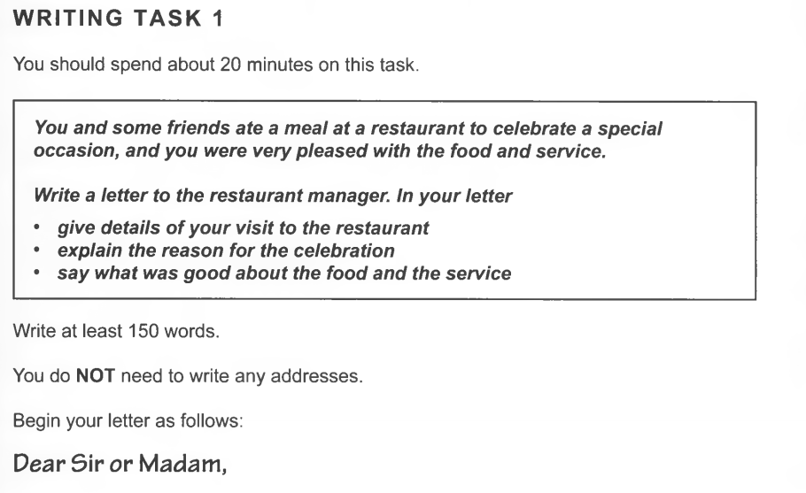
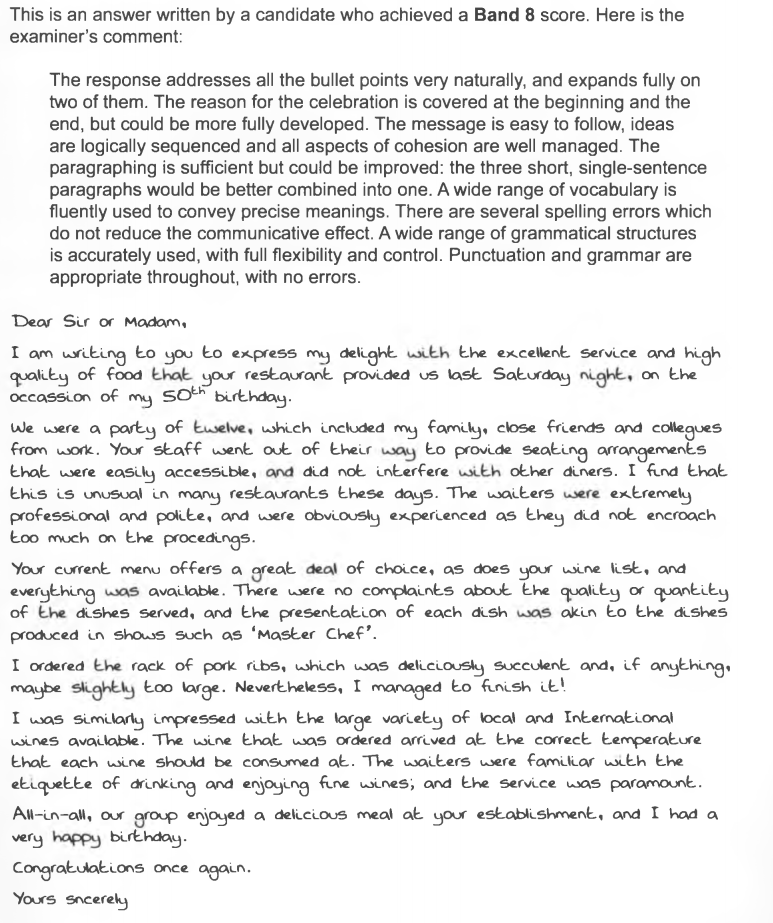
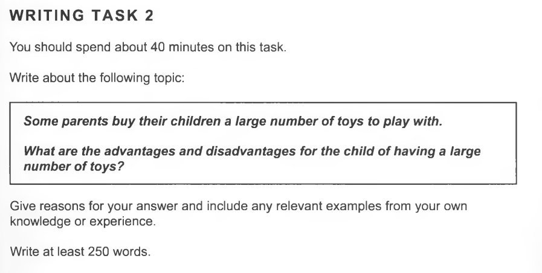
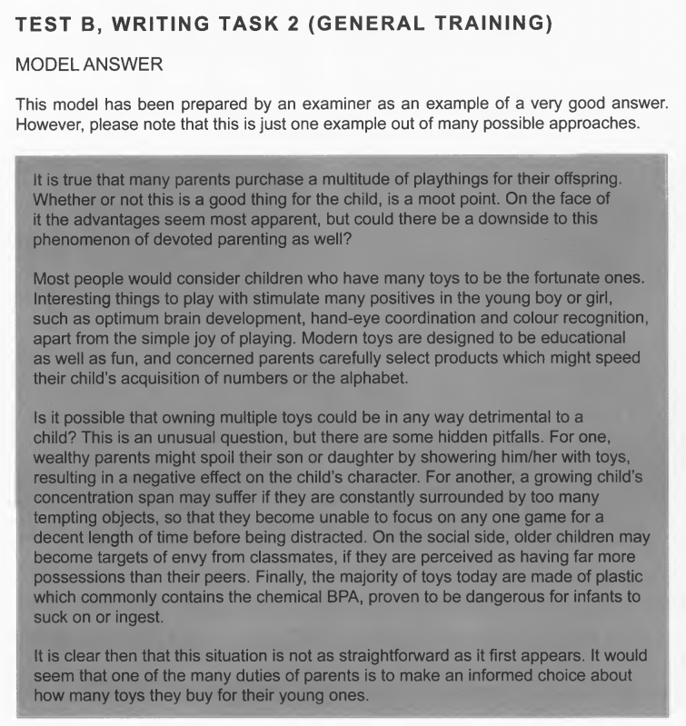

## topic 1.1

>Dear Sir or Madam,
Me and my friends had a wonderful dinner at your restaurant. How to say that, when I went to have the same steak at my place, I was wondering how hard cooking something can really be. It's just using the best meat that I have, with all the thing and little secretes from the recipe, after all this that I could only figure out what a great job that you have done to those beef. They are just amazing. So, last Thursday night, while hanging for a rather long time wondering the exhibition held by my friend Jack, with the mask on for a very long time, still trying to respond to people's questions, Jack suggested to have some well-cooked meat to fill us up, also to celebrate the success and completion of the long lasted event. 
Your steak house is of an exotic genre, from the outside we thought it's a good whisky bar, but with no expectation for the food. However, your professionalism just shocked us down. The wine, the music, together mixed with the aroma from the food... Just as fantastic and surprise as you gave to us! We really have to admit that you're a total genius.
Thanks again for the meal, as all the experiences. Also looking forward for your craft beer as well.
Best wishes,

Joseph

>$1$ event, people, time all seemed common as water, as very general expressions used
$2$ seating arrangement--> **went out of the way** instead of surprise  easily accessible, /did not interfere with the dinner/i find it unusual these days other restaurant
TODO
$3$ current menu great deal of choice/ wine list 
$4$ i ordered/ pork fibs/delicious and sufficient /*if anything* maybe too large/manage to finish it
$5$ impressed with local and international wine/correct temperature/waiter etiquette/service was paramount
$6 enjoyed a delicious meal **at your establishment**

## topic 1.2

>Toys are one of the sweet memories for all of us when enjoying our worriless and innocent kids' moments. It's well noticed that, parents tend to buy a large number of toys, which benefits from the development of modern industry, however can be a challenge of environment in the future.
Toys are sweet, they are designed and developed ever back in long last history. Children are actually learning by playing toys, no matter it's a car or a barbie doll. Kids are developing their little brain in the progress of playing the toys they are given, by interacting with these little things. Also, toys are librating the parents from being "the toy" of their kids. So, the reason for parents to buy a lot of toys are clear, not to mention their love for the kid and under their begging for a lot of times.
Toys also have their problem once it's given to much. Like learning, you never learned only if you dig deep enough into one thing rather than take overviews of one thousand. Kids can be easily satisfied when given new gift, but they never learned from simple asking. With more stuff created in the market, we also create billions of waste and pollution to the environment. Kids are growing up and getting boring of their last toy, but environment can't really take too much.
However, in my opinion, toys are positive, especially in a world full of computer games. What I'm thinking of a great resolution is a proper combination of both computer and real toys, that parents should never leaning much over to only one side. 

>$1$ a multitude of --> a lot of/ for their **offspring**/whether or not, **moot** point/phenomenon
$2$ fortunate/apart from /educational as well as fun/ **concerned** **parent** select to speed up child's acquisition of numbers and alphabet
$3$ **detrimental**/ hidden **pitfalls**/ showering them with toys/**concentration span** may suffer from too many tempting objects/
$5$ not as straightforward as it first appears/one of duties is informed choice ab**out buying **/